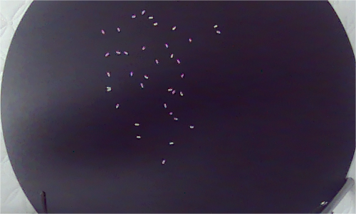

# opencv-and-robotic-arm-catching-ducks

## Introduction
This is an exercise repositories. This is an exercise repository. We used Orbbec's Gemini2L and JAKA six-axis robotic arm. 
## Mehod
1. We used a checkerboard to calibrate the coordinate systems of the robotic arm and camera.
2. We used yellow to detect ducks, and then let the robotic arm go to the duck's location.

3. Our ultimate goal is to use robotic arms to sort rice, and there are still many problems that need to be solved.
